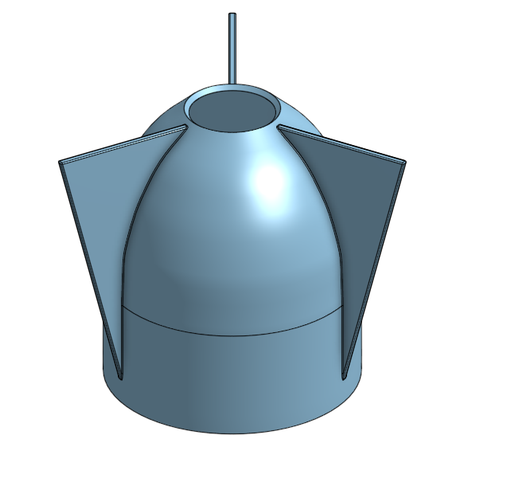
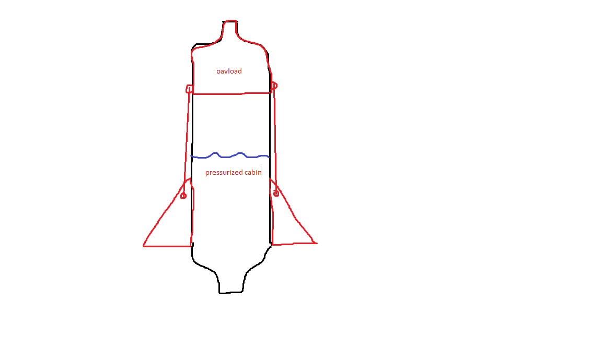
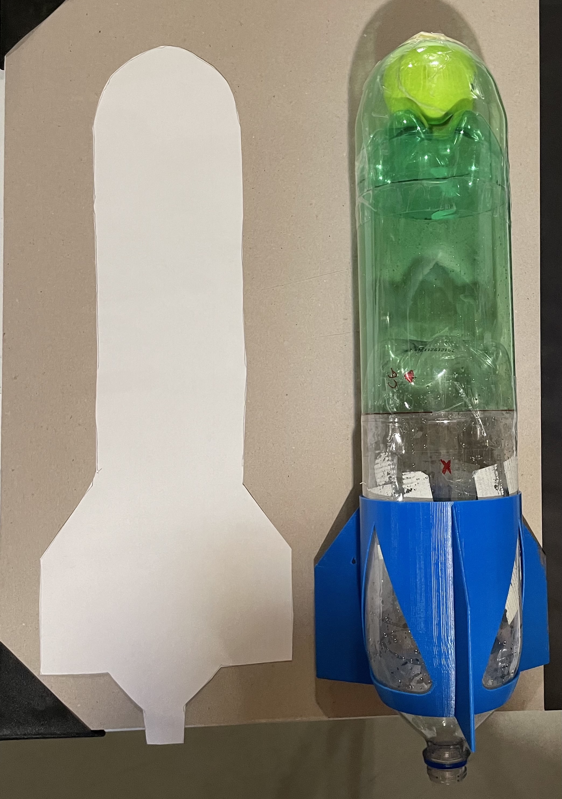
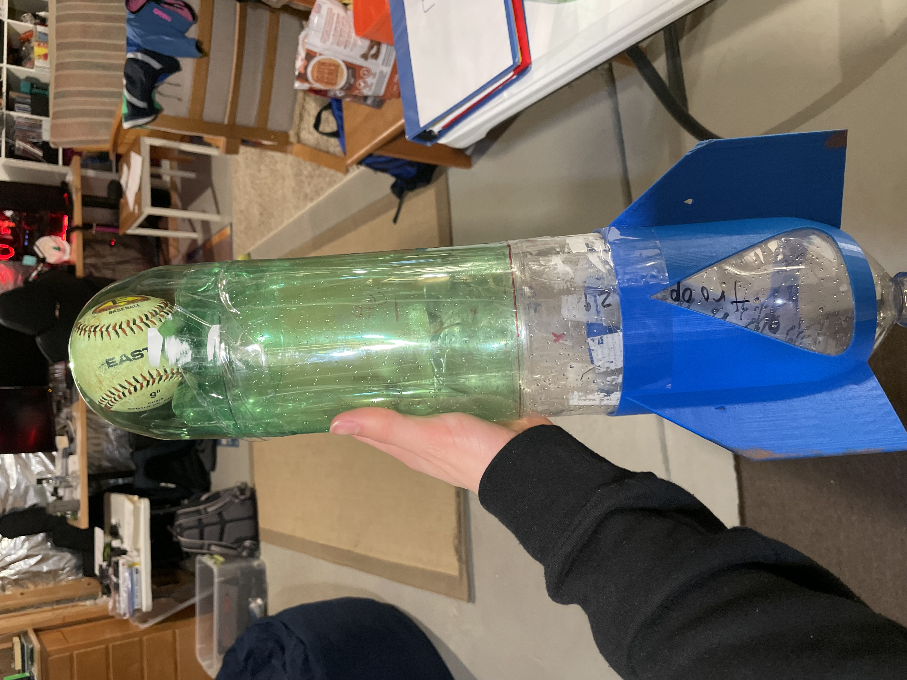

# Pi-in-the-Sky
Task: Launch Raspberry Pi into the sky, collect data, and do something at the apex of the Pi's flight. Additionally, make sure landing is safe enough to protect the Pi.

## Table of Contents
* [Planning](#Planning)
  * [Initial Ideas](#Initial-Ideas)
  * [To-Do](#To-Do)

 
 

# Planning
## Initial Ideas
  * Supersonic Potato Cannon
    * Pros - High altitude, powerful
    * Cons - Difficult to materialize, expensive, extremely dangerous, difficult to transfer
  * Hot Air Balloon
    * Pros - Floats for a long time, high altitude
    * Cons - Slow, hard to heat and contain air
  * Bottle Rocket
    * Pros - High altitude, lightweight, easy to construct, flexible
    * Cons - Maximum PSI limits potential height, mildly dangerous due to high pressure

## Final Design Plan
We decided to make a Bottle Rocket due to the inexpensive, easy construction, and the flexibility of the design. The maximum PSI will not limit the height drastically, and the path of the flight could be controlled by varying the pressure and angle at lauch. Additionally, we will use a barometric pressure sensor to determine the altitude and release a parachute when the rocket is at its apex. [Multi-stage bottle rocket explanation](http://www.aircommandrockets.com/howitworks_1.htm)

### Materials
* 2 liter bottles
* 3d printed fins
* 3d printed nosecone
* 3d printed or lasercut casing for electronics
* Parachute
* Electronic components - 
  * Raspberry Pi Zero
  * MPL3115A2 barometric pressure altimeter
  * Battery
  * Circuit board
  * Servo
  * Buttons
  * RGB LED indicator

### Risk Mitigation
To ensure our safety whilst using potentially dangerous compressed air, we will always wear safety glasses when the launcher is pressurized. Additionally, we will clearly communicate when the launcher is pressurized and when the pressure will be released and the rocket launched.

### Pseudocode
User presses button  
Start recording altitude 
Change LED color to show that it is recording 
Turn servo to release parachute once it starts falling 
User presses button to end recording 
Recorded data is written to CSV file 

 
 

### Payload, Parachute, and Parameters

For the design of the payload and top of the rocket, we decided to cut the bottom of another bottle off and place it on the top of the inital rocket to give a platform for the payload, and we are going to attach a 3d printed cone to the top of both bottles which will house the parachute and release mechanism and be held on by strings tied to the fins. 

 
 

#  ***To-Do***
* ***Design parachute release mechanism***
* ***Create stronger rocket***
  * Create and print fins
  * Possibly create two staged rocket (Helmstetter)
  * Possible mid-air propulsion system
* ***Design place for Pi on the rocket***
* ***Code accelerometer***
  * Find max height
  * Get information at max height
  * Gather information during the flight
* ***Code parachute deploy***
  * Create system to deploy parachute
* ***Code barometric pressure altitude sensor***
* ***CAD***
  * Fins
  * Pi Holder
  * Camera mount
  * Parachute release
  * Possible connector or valve for multi-stage 

# Tentative Schedule
 * Week of 1.10 - Finish sleeve to go around rocket
 * Week of 1.17 - Determine method of attaching payload
 * Week of 1.24 - Design and  work on creation of payload
 * Week of 1.31 - Coding and fabrication of payload electronics and cone
 * Week of 2.7 - Finish fabrication and test rocket launch
 * Week of 2.14 - finish fabrication and test rocket
 * Week of 2.21 - Test electronics, if successful, try launching with electronics. If not, get electronics working
 * Week of 2.28 - Continue testing electronics
 * Week of 3.7 - If electronics working, test launching with electronics. If launch successful, ADD BOOSTERS.
 * Week of 3.14 - Get boosters working
 * Week of 3.21 - Get boosters working better.
 * Week of 3.28 - Documentation and getting boosters and electronics working
 * Week of 3.28 through week of 5.9 - Refine boosters, launching system, and rocket, and complete documentation.
# 1.11.22
 ### Work done -
 * Found diameter of bottle laser cutting circles with successively larger diameters until it fit snugly, which happened with a 107mm circle, meaning the real diameter of the bottle is closer to ~ 107.14mm due to the 0.14mm kerf of the laser. This measurement will be used to 3d print a friction fit sleeve on which the fins will be mounted.

# 1.13.22
  ### Work done - 
  * 3d printed mock sleeve to friction fit full sleeve eventually, spoke with Mr. Helmstetter about future multistage two body propulsion of the rocket, and created a prototype sleeve for the rocket
   

# 1.19.22
  ### Work done - 
  * Wrote test barometric pressure altimeter code which prints pressure, altitude, and temperature read from the MPL3115A2 barometric pressure altimeter

# 1.21.22
 ### Work done -
 * Determined method for attaching payload to rocket and securing payload container to rocket.  
    

# 1.25.22
 ### Work done -
 * Made tentative schedule and came up with the design for parachute deployment using a nosecone that opens and releases the parachute after a servo releases it. Also finalized base of rocket and fins.

# 1.27.22
  ### Work done -
  * Finalized design of fins and attachment
  * Wrote pseudocode for Raspberry Pi function during launch, began working on code

# 1.31.22
  ### Work done -
  * Worked on the onshape design of the top cone 
  * Worked on code for recording barometer data to a CSV file so it can be easily plotted

# 2.1.22
  ### Work done -
  * Did first test launch(es)
    * Lessons learned 
    * Bigger and more robust fins that are higher up
    * Use launcher that has a set trajectory 
  * Got altitude to record to a csv with timestamps

# 2.3.22
  ### Work done-
  * Moved fins further up so they will be more in the air stream and made wider so they would be less delicate
  * Coded the accelerometer

# 2.7.22
  ### Work done -
  * Updated CSV recorder so it will record temperature, barometric pressure, and accelerometer x, y, and z readings
  * Add a button to start recording data

# 2.8.22
  ### Work done - 
  * Changed MPL3115A2 library Python file `/usr/local/lib/python3.7/dist-packages/adafruit_mpl3115a2.py` on line 147 from `REG1_OS128` to `REG1_OS8` which seems to increase the cycle speed of the barometric pressure altimeter
  * Finished most of the cone, including servo and torsion spring holder.
  * Tested parachute to make sure diameter was large enough

# 2.14.22
  ### Work done -
  * Two test launches of rocket with new fins
    * First launch 
      * 600mL water
      * not enough thrust since much of the water leaked, very strong launch though
      * 90 PSI
    * Second launch
      * Leaking through launch malfunction
      * Almost killed second most valuable teammate 
      * almost lost a finger (or 3)

# 2.15.22
### Work To Do -
  
  * Input up to date screenshots of the base of fins, cone, and the assembly
  * add eyelets onto the cone
  * Do another launch test with 750 mL water with a fixed launcher with two clamps instead of one
  
### Work Done - 
|Launch|Water (ml)|PSI|Launch Notes|
|-|-|-|-|
|1|700|95|Rocket turned sharply back and to the right immediately after launch|
|2|600|70|Rocket turned sharply back and to the left, the same direction as the scraped fin|
|3|600|65|Rocket turned to the right but circled around to the left behind the launcher|
|3|600|65|Rocket started straighter than other launches but still turned toward scraped fin|

# 2.22.22 (wow)
### Work done - 
* Worked on PCB
* Worked on Cone for tip of rocket and hinge for releasing the parachute
* Prepared for launches next class

# 2.24.22
### Work done - 

* Launches!

|Launch|Water (ml)|PSI|Launch Notes|
|-|-|-|-|
|1|600|70|Sharp turn to the right of the launcher, small puff of water at the end indicating a lack of water|
|2|700|70|Sharp right turn at launch, a smaller puff of water at the end indicating more water needed for full potential|
|3|800|70|Sharp right turn, no puff at the end indicating a proper amount of water inside|
|4|800|105|Sharp right turn off the launch, no puff at the end indicating the proper amount of water. Very high launch velocity. |
* Finished(?) PCB

# 2.26.22
### Work Done -
* After getting pretty darn fed up with all of the ways that the rocket has been failing, we decided to take a step back and redesign.
  * I went online and did some research on rockets and came across two articles explaining [two topics](https://www.nakka-rocketry.net/fins.html#cgcp), one familiar, and one pretty new to me.
  * These two topics are known as the center of mass and the center of pressure. The center of mass is where an object is perfectly balanced horizontally and vertically, and the center of pressure is the center of force where the aerodynamic pressure acts upon it.
  * In order for there to be balance in the rocket and for it to fly straight, the center of pressure must be two inches or more behind the center of mass.
  *  We tested the center of pressure by taking the surface area of the rocket (A cutout of the rocket surface area) and then used a finger to determine the center of mass of the folded up diagram. This would determine the center of pressure on the rocket. 
  *  When looking at our rocket, the center of mass and center of pressure was in the same location. This is extremely bad.
  * We added length to the rocket and added in a baseball instead of a tennis ball to hopefully move the center of mass forwards, and sure enough, it ended up being around 3.5 inches further up the ball than it was previously.
  
    
    

  * Needless to say, this did the trick...!!!!

 
