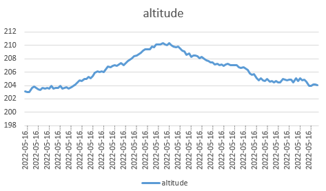
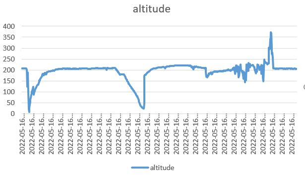
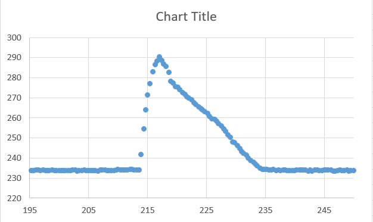
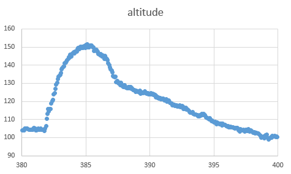

# Pi-in-the-Sky
Task: Launch Raspberry Pi into the sky, collect data, and do something at the apex of the Pi's flight. Additionally, make sure landing is safe enough to protect the Pi.

## Table of Contents
* [Planning](#Planning)
  * [Initial Ideas](#Initial-Ideas)
  * [To-Do](#To-Do)

 
 

# Planning
## Initial Ideas
  * Supersonic Potato Cannon
    * Pros - High altitude, powerful
    * Cons - Difficult to materialize, expensive, extremely dangerous, difficult to transfer
  * Hot Air Balloon
    * Pros - Floats for a long time, high altitude
    * Cons - Slow, hard to heat and contain air
  * Bottle Rocket
    * Pros - High altitude, lightweight, easy to construct, flexible
    * Cons - Maximum PSI limits potential height, mildly dangerous due to high pressure

## Final Design Plan
We decided to make a Bottle Rocket due to the inexpensive, easy construction, and the flexibility of the design. The maximum PSI will not limit the height drastically, and the path of the flight could be controlled by varying the pressure and angle at lauch. Additionally, we will use a barometric pressure sensor to determine the altitude and release a parachute when the rocket is at its apex. [Multi-stage bottle rocket explanation](http://www.aircommandrockets.com/howitworks_1.htm)

### Materials
* 2 liter bottles
* 3d printed fins
* 3d printed nosecone
* 3d printed or lasercut casing for electronics
* Parachute
* Electronic components - 
  * Raspberry Pi Zero
  * MPL3115A2 barometric pressure altimeter
  * Battery
  * Circuit board
  * Servo
  * Buttons
  * RGB LED indicator

### Risk Mitigation
To ensure our safety whilst using potentially dangerous compressed air, we will always wear safety glasses when the launcher is pressurized. Additionally, we will clearly communicate when the launcher is pressurized and when the pressure will be released and the rocket launched.

### Pseudocode
User presses button  
Start recording altitude 
Change LED color to show that it is recording 
Turn servo to release parachute once it starts falling 
User presses button to end recording 
Recorded data is written to CSV file 

 
 

### Payload, Parachute, and Parameters

For the design of the payload and top of the rocket, we decided to cut the bottom of another bottle off and place it on the top of the inital rocket to give a platform for the payload, and we are going to attach a 3d printed cone to the top of both bottles which will house the parachute and release mechanism and be held on by strings tied to the fins. 

 
 

#  ***To-Do***
* ***Design parachute release mechanism***
* ***Create stronger rocket***
  * Create and print fins
  * Possibly create two staged rocket (Helmstetter)
  * Possible mid-air propulsion system
* ***Design place for Pi on the rocket***
* ***Code accelerometer***
  * Find max height
  * Get information at max height
  * Gather information during the flight
* ***Code parachute deploy***
  * Create system to deploy parachute
* ***Code barometric pressure altitude sensor***
* ***CAD***
  * Fins
  * Pi Holder
  * Camera mount
  * Parachute release
  * Possible connector or valve for multi-stage 

# Tentative Schedule
 * Week of 1.10 - Finish sleeve to go around rocket
 * Week of 1.17 - Determine method of attaching payload
 * Week of 1.24 - Design and  work on creation of payload
 * Week of 1.31 - Coding and fabrication of payload electronics and cone
 * Week of 2.7 - Finish fabrication and test rocket launch
 * Week of 2.14 - finish fabrication and test rocket
 * Week of 2.21 - Test electronics, if successful, try launching with electronics. If not, get electronics working
 * Week of 2.28 - Continue testing electronics
 * Week of 3.7 - If electronics working, test launching with electronics. If launch successful, ADD BOOSTERS.
 * Week of 3.14 - Get boosters working
 * Week of 3.21 - Get boosters working better.
 * Week of 3.28 - Documentation and getting boosters and electronics working
 * Week of 3.28 through week of 5.9 - Refine boosters, launching system, and rocket, and complete documentation.
# 1.11.22
 ### Work done -
 * Found diameter of bottle laser cutting circles with successively larger diameters until it fit snugly, which happened with a 107mm circle, meaning the real diameter of the bottle is closer to ~ 107.14mm due to the 0.14mm kerf of the laser. This measurement will be used to 3d print a friction fit sleeve on which the fins will be mounted.

# 1.13.22
  ### Work done - 
  * 3d printed mock sleeve to friction fit full sleeve eventually, spoke with Mr. Helmstetter about future multistage two body propulsion of the rocket, and created a prototype sleeve for the rocket
   

# 1.19.22
  ### Work done - 
  * Wrote test barometric pressure altimeter code which prints pressure, altitude, and temperature read from the MPL3115A2 barometric pressure altimeter

# 1.21.22
 ### Work done -
 * Determined method for attaching payload to rocket and securing payload container to rocket.  
    

# 1.25.22
 ### Work done -
 * Made tentative schedule and came up with the design for parachute deployment using a nosecone that opens and releases the parachute after a servo releases it. Also finalized base of rocket and fins.

# 1.27.22
  ### Work done -
  * Finalized design of fins and attachment
  * Wrote pseudocode for Raspberry Pi function during launch, began working on code

# 1.31.22
  ### Work done -
  * Worked on the onshape design of the top cone 
  * Worked on code for recording barometer data to a CSV file so it can be easily plotted

# 2.1.22
  ### Work done -
  * Did first test launch(es)
    * Lessons learned 
    * Bigger and more robust fins that are higher up
    * Use launcher that has a set trajectory 
  * Got altitude to record to a csv with timestamps

# 2.3.22
  ### Work done-
  * Moved fins further up so they will be more in the air stream and made wider so they would be less delicate
  * Coded the accelerometer

# 2.7.22
  ### Work done -
  * Updated CSV recorder so it will record temperature, barometric pressure, and accelerometer x, y, and z readings
  * Add a button to start recording data

# 2.8.22
  ### Work done - 
  * Changed MPL3115A2 library Python file `/usr/local/lib/python3.7/dist-packages/adafruit_mpl3115a2.py` on line 147 from `REG1_OS128` to `REG1_OS8` which seems to increase the cycle speed of the barometric pressure altimeter
  * Finished most of the cone, including servo and torsion spring holder.
  * Tested parachute to make sure diameter was large enough

# 2.14.22
  ### Work done -
  * Two test launches of rocket with new fins
    * First launch 
      * 600mL water
      * not enough thrust since much of the water leaked, very strong launch though
      * 90 PSI
    * Second launch
      * Leaking through launch malfunction
      * Almost killed second most valuable teammate 
      * almost lost a finger (or 3)

# 2.15.22
### Work To Do -
  
  * Input up to date screenshots of the base of fins, cone, and the assembly
  * add eyelets onto the cone
  * Do another launch test with 750 mL water with a fixed launcher with two clamps instead of one
  
### Work Done - 
|Launch|Water (ml)|PSI|Launch Notes|
|-|-|-|-|
|1|700|95|Rocket turned sharply back and to the right immediately after launch|
|2|600|70|Rocket turned sharply back and to the left, the same direction as the scraped fin|
|3|600|65|Rocket turned to the right but circled around to the left behind the launcher|
|3|600|65|Rocket started straighter than other launches but still turned toward scraped fin|

# 2.22.22 (wow)
### Work done - 
* Worked on PCB
* Worked on Cone for tip of rocket and hinge for releasing the parachute
* Prepared for launches next class

# 2.24.22
### Work done - 

* Launches!

|Launch|Water (ml)|PSI|Launch Notes|
|-|-|-|-|
|1|600|70|Sharp turn to the right of the launcher, small puff of water at the end indicating a lack of water|
|2|700|70|Sharp right turn at launch, a smaller puff of water at the end indicating more water needed for full potential|
|3|800|70|Sharp right turn, no puff at the end indicating a proper amount of water inside|
|4|800|105|Sharp right turn off the launch, no puff at the end indicating the proper amount of water. Very high launch velocity. |
* Finished(?) PCB

# 2.26.22
### Work Done -
* After getting pretty darn fed up with all of the ways that the rocket has been failing, we decided to take a step back and redesign.
  * I went online and did some research on rockets and came across two articles explaining [two topics](https://www.nakka-rocketry.net/fins.html#cgcp), one familiar, and one pretty new to me.
  * These two topics are known as the center of gravity and the center of pressure. The center of gravity is where an object experiences the effect of gravity, and the center of pressure is the "center of force where the aerodynamic pressure acts upon it".
  * In order for there to be balance in the rocket and for it to fly straight, the center of pressure must be two inches or more behind the center of mass.
  *  We tested the center of pressure by taking the surface area of the rocket (A cutout of the rocket surface area) and then used a finger to determine the center of mass of the folded up diagram. This would determine the center of pressure on the rocket. 
  *  When looking at our rocket, the center of gravity and center of pressure was in the same location. This is extremely bad.
  * We added length to the rocket and added in a baseball instead of a tennis ball to hopefully move the center of gravity forwards, and sure enough, it ended up being around 3.5 inches further up the ball than it was previously.
  
    
    

  * Needless to say, this did the trick...!!!!

 

# 2.28.22
### Work Done - 
* Test launched for the class to see, perfect trajectory. Flight path of the rocket is entirely figured out.

# 3.1.22
### Work done -
* Finished PCB and printed! One problem - The holes for the Pi are not in the proper location. This means we have to figure out why the PCB Diagram was incorrect next class.

# 3.3.22
### Work done -
* Fixed problem with small pin spacing in 
* Discussed a few crucial problems we need to work out
  * Problems to work on -
    * Where to place PCB
    * Where to put weight(Copper Shot)
    * How to store PCB to have minimal damage if parachute fails
    * Where to tie parachute to rocket with most stability and with least tangled cords

# 3.7.22
### Work Done - 
* Starting cutting of fixed PCB
* Determined location of PCB will be in the middle compartment for the time being, and created a location to put the Copper shot for the weight of the rocket.

# 3.8.22
### Work Done - 
* Ground off the copper on the back of PCB Plate
* Created cavity in cone for Copper shot and calculated the volume of the small cone we will need to have to satisfy our weight needs
* Fixed cone diameter, which entailed redesigning some features to be more flexible, and changed torsion spring holder to fir the springs we have

# 3.10.22
### Work Done -
* Finished design for cone and started 3d print
* Soldered headers and components to PCB
* Figured out why the Raspberry Pi was shutting down every time we plugged it in to the PCB
* Rotated two of the switches π/2 radians so they wouldn't cause a short and turn off the Pi

# 3.14.22
### Work Done
* Soldered more to try and fix various connections.
* Discovered that Pi was mirrored and therefore we were plugging it in backwards the whole time and somehow didn't fry multiple Pis.

# 3.16.22
#### Work Done
* Resoldered a new header onto the Pi
* Resoldered RGB LEDs
* Everything now working except for code for Altimeter and arming mechanism. Will print next class

# 3.21.22
### Work Done
* Got code working along with rocket, and tested functionality of all seperate pieces and they all worked perfectly
* Servo activated and servo twisted to open the cone when the altimeter detected a change in barometric pressure. Parachute popped out and should have enough time to catch air and float safely to the ground.
* Will try to test by next class! 

# 3.22.22
### Work Done
* ***Tested...***
  * *It didn't work.* The code worked properly and turned the servo which should have released the rubber band holding the cone close, releasing the parachute, but for some reason (something got tangled possibly) it didn't open
  * Upon impact with the ground, the cone split severely and our PCB, which was bolted to the inside of the bottle, also cracked
* ***What we learned from the launch -***
  * Test more than you think you need to before actually launching
  * Test parts independently of one another, and then slowly add more and more parts to the testing until you have done as much as you can without actually launching or activating the project.
  * Rethink the way the parachute deploys. Maybe deploy from the side, or the bottom, rather than the top.
  * Rethink the attachment of the PCB to the rocket. Don't attach straight to the rocket in order to prevent catastrophic failures like what happened during this launch.

# 3.24.22
### Work Done
* Glued PCB back together and soldered traces across where it had broken
* Started designing new cone with parachute release based on [this](https://www.youtube.com/watch?v=COkh5ykzC3Y) video

# 3.28.22
### Work Done
* Worked on design of the new cone

# 3.30.22
### Work Done
* Finished design of new cone! Added in wall to catch servo arm and holes to prevent the face of the rocket from falling into oblivion when parachute deploys.
* Printed the top cone to see if it will work through ground testing.

# 4.11.22
### Work Done
* Tested how the parachute door fit on the top part of cone
* Printed bottom part of cone

# 4.12.22
### Work Done
* Bolted together top and bottom parts of cone
* Attached servo and servo horn
* Tested parachute release mechanism
* Tested parachute and realized that we need a larger parachute given the mass of our rocket

# 4.14.22
### Work Done
* Made larger parachute out of old umbrella and tested with a weight
* Cut larger hole in cone for parachute cords and shock cord made out of several rubber bands

# 4.17.22
### Work Done
* Assembled and tested rocket
* Due to how the electronics were packed, all of the weight of the circuit board and battery were resting on the SD card, causing it to crack under the force of the rapid acceleration at launch
* Since the SD card broke, the parachute door stayed closed, so it hit the ground without being slowed at all, causing everything to break

# 4.17.22 - 5.16.22
### Work Done
* Lots of AP Exams majorly halted progress, as well as work for CAD Exams.
* Worked on fixing code after major fails, as well as re-fixing the SD card due to a freak deep-fry accident.
* Glued circuit board together and resoldered broken connections
* Re-did services on the Pi like 19 times due to frying and/or killing 2 SD cards
* Tested multiple different variations of code, and as of 5/16/22 working towards test launching JUST the circuitry inside of a working rocket to determine if the code will fail under real conditions

# 5.17.22
### Work Done
* Finished recreating and succesfully tested code
* Finally emptied bins of unused components

# 5.19.22
### Work Done
* Fixed Shutdown button code to make it more apparent that the pi has actually shut down
* ***Important!!!!*** - Figured out that the Altimeter does NOT work if there is no air flow access to the altimeter. This was determined after multiple launches without air flow access being unsuccessful, and having very odd results, but there being perfect results with air flow access going up and down stairs.
* with air access - 
* without air access - 

# 5.22.22
### Work Done
* Got data from backpacking on fathers rocket, AND by cutting holes in the cabin that holds the Pi and altimeter to allow the barometer to collect accurate data.
* ### Data - 

# 5.24.22
### Work Done
* Launched with a safety remote to make sure we don't have a catastrophic failure
* All went to plan, the parachute opened when the altitude began decreasing and nothing broke
* ### Data - 
* ### Final video -  

# ***Conclusion!***
## Final thoughts
* Overall, this project was incredibly challenging, but many things could have been avoided through research and a bit of protection for the rocket.
* The creation of the body and launcher by [William Keenan](https://github.com/willhk10) and co-creating the CAD model for parachute deployment were all extremely fun and took a large amount of research and planning. The body of the rocket was not easily made, with weight being neeeded in the front to provide for a straight flight. This was a challenge that was overcome in the beginning of the project, as the flight path of the rocket was one of the most important aspects of the project.
* The launcher was not that difficult to design, as many online sources have created diagrams and schematics for launchers. The only difference between our launcher and other generic launchers was that ours was made of metal piping, and not PVC.
* The code, made by [Alden Dent](https://github.com/adent11) was not only incredibly effective, but it was easily debugged. This proved to be incredibly useful towards the end of the project, when we figured out that the altimeter had to be open to the atmosphere.
* The PCB, also created by Alden, was a bit of a rollercoaster. With the combination of learning how to use a new machine, new software, and confusing circuitry, there were a few hiccups documented. However, in the end, we got it all working, and it looked professional.

## Challenges 
* The PCB breaking multiple times could have been easily prevented by simply putting a lot of foam or protection around the PCB.
* The code not working was not actually the code being faulty. In reality, the altimeter just could not detect changes in pressure when inside of a sealed container. We just could never figure this out until the very end of the project because all of the launches inside of a sealed container crashed and did not give any altimeter data.
* The CAD design was not only very flawed at the beginning, but it was also faulty due to the altimeter not collecting accurate information. Besides that, after one redesign, we had a working model. 
* Overall there were very few challenges, but they each took a lot of time and effort to get through.
